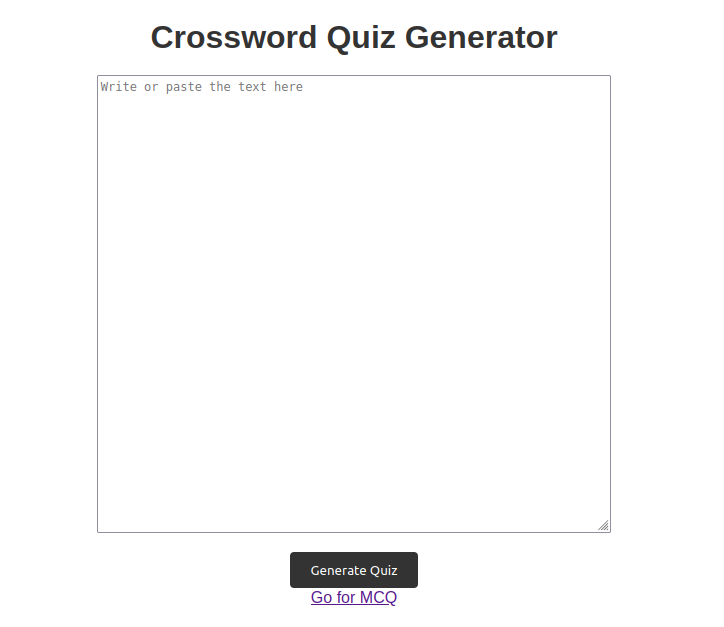

# QuizGenerator
Project Description:

The "Automatic MCQ and Crossword Generator from Text" is an innovative AI project that aims to automate the creation of multiple-choice questions (MCQs) and crossword puzzles from textual content, such as paragraphs, articles, or documents. This project leverages natural language processing (NLP) techniques and machine learning to extract key information from text and generate educational materials for various purposes, such as assessments, learning aids, and quizzes.

Key Features:

Text Processing: The system will accept input in the form of text, which can be a paragraph, article, or any textual content. It will utilize NLP techniques to analyze and extract relevant information from the text.

MCQ Generation:

Topic Identification: The system will identify the main topics or themes within the text.
Question Generation: It will generate multiple-choice questions related to the identified topics.
Answer Choices: The system will provide plausible answer choices for each question.
Difficulty Levels: It will categorize questions into different difficulty levels, making it suitable for a variety of audiences.
Crossword Puzzle Generation:

Vocabulary Extraction: The project will extract relevant vocabulary words from the text.
Grid Creation: It will create crossword puzzle grids that incorporate the extracted words.
Clue Generation: For each word in the puzzle, the system will generate corresponding clues or hints.

User Interface: The project will include a user-friendly interface, allowing educators, content creators, and learners to input text and generate MCQs and crossword puzzles with ease.

Scalability: The system will be designed to handle large volumes of text and generate questions and puzzles efficiently.

Technologies Used:

Natural Language Processing (NLP) libraries and tools (e.g., NLTK, spaCy)
User interface development (web-based or application)
Use Cases:

Education: Teachers and educators can use the system to create quizzes and educational materials quickly.

Content Creation: Content creators can integrate MCQs and crossword puzzles into their articles or e-learning platforms.

Self-assessment: Learners can use the generated questions and puzzles for self-assessment and practice.

Games and Entertainment: The crossword puzzles can also be used for leisure and entertainment.

#How to Run
1. Pull the Project
2. Install requrements.txt
3. run App.py

